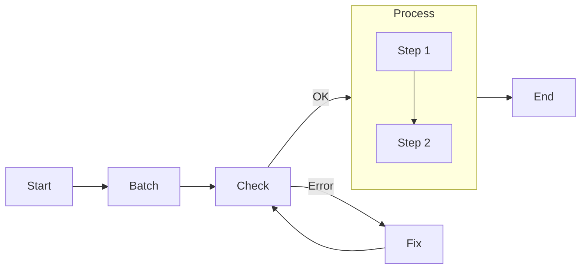

# PocketFlow Skill

A comprehensive guide to building LLM applications using PocketFlow - a 100-line minimalist framework for Agents, Task Decomposition, RAG, and more.

## When to Use This Skill

Activate this skill when working with:
- **Graph-based LLM workflows** - Building complex AI systems with nodes and flows
- **Agentic applications** - Creating autonomous agents with dynamic action selection
- **Task decomposition** - Breaking down complex LLM tasks into manageable steps
- **RAG systems** - Implementing Retrieval Augmented Generation pipelines
- **Batch processing** - Handling large inputs or multiple files with LLMs
- **Multi-agent systems** - Coordinating multiple AI agents
- **Async workflows** - Building I/O-bound LLM applications with concurrency

## Core Concepts

### Architecture Overview

PocketFlow models LLM workflows as **Graph + Shared Store**:

```python
# Shared Store: Central data storage
shared = {
    "data": {},
    "summary": {},
    "config": {...}
}

# Graph: Nodes connected by transitions
node_a >> node_b >> node_c
flow = Flow(start=node_a)
flow.run(shared)
```

### The Node: Building Block

Every Node has 3 steps: `prep()` → `exec()` → `post()`

```python
class SummarizeFile(Node):
    def prep(self, shared):
        # Get data from shared store
        return shared["data"]

    def exec(self, prep_res):
        # Process with LLM (retries built-in)
        prompt = f"Summarize this text in 10 words: {prep_res}"
        summary = call_llm(prompt)
        return summary

    def post(self, shared, prep_res, exec_res):
        # Write results back to shared store
        shared["summary"] = exec_res
        return "default"  # Action for flow control
```

**Why 3 steps?** Separation of concerns - data storage and processing operate separately.

### The Flow: Orchestration

```python
# Simple sequence
load_data >> summarize >> save_result
flow = Flow(start=load_data)
flow.run(shared)

# Branching with actions
review - "approved" >> payment
review - "needs_revision" >> revise
review - "rejected" >> finish
revise >> review  # Loop back

flow = Flow(start=review)
```

## Quick Reference

### 1. Basic Node Pattern

```python
class LoadData(Node):
    def post(self, shared, prep_res, exec_res):
        shared["data"] = "Some text content"
        return None

class Summarize(Node):
    def prep(self, shared):
        return shared["data"]

    def exec(self, prep_res):
        return call_llm(f"Summarize: {prep_res}")

    def post(self, shared, prep_res, exec_res):
        shared["summary"] = exec_res
        return "default"

# Connect and run
load_data >> summarize
flow = Flow(start=load_data)
flow.run(shared)
```

### 2. Batch Processing

**BatchNode** - Process large inputs in chunks:

```python
class MapSummaries(BatchNode):
    def prep(self, shared):
        # Chunk big file
        content = shared["data"]
        chunk_size = 10000
        return [content[i:i+chunk_size]
                for i in range(0, len(content), chunk_size)]

    def exec(self, chunk):
        # Process each chunk
        return call_llm(f"Summarize: {chunk}")

    def post(self, shared, prep_res, exec_res_list):
        # Combine all results
        shared["summary"] = "\n".join(exec_res_list)
        return "default"
```

**BatchFlow** - Run flow multiple times with different parameters:

```python
class SummarizeAllFiles(BatchFlow):
    def prep(self, shared):
        filenames = list(shared["data"].keys())
        # Return list of parameter dicts
        return [{"filename": fn} for fn in filenames]

class LoadFile(Node):
    def prep(self, shared):
        # Access filename from params
        filename = self.params["filename"]
        return filename
```

### 3. Agent Pattern

```python
class DecideAction(Node):
    def exec(self, inputs):
        query, context = inputs
        prompt = f"""
Given input: {query}
Previous search results: {context}
Should I: 1) Search web for more info 2) Answer with current knowledge

Output in yaml:
```yaml
action: search/answer
reason: why this action
search_term: search phrase if action is search
```"""
        resp = call_llm(prompt)
        yaml_str = resp.split("```yaml")[1].split("```")[0]
        action_data = yaml.safe_load(yaml_str)
        return action_data

# Build agent graph
decide >> search_web
decide - "answer" >> provide_answer
search_web >> decide  # Loop back for more searches

agent_flow = Flow(start=decide)
```

### 4. RAG (Retrieval Augmented Generation)

**Stage 1: Offline Indexing**

```python
class ChunkDocs(BatchNode):
    def prep(self, shared):
        return shared["files"]

    def exec(self, filepath):
        with open(filepath, "r") as f:
            text = f.read()
        # Chunk by 100 chars
        size = 100
        return [text[i:i+size] for i in range(0, len(text), size)]

    def post(self, shared, prep_res, exec_res_list):
        shared["all_chunks"] = [c for chunks in exec_res_list
                                for c in chunks]

chunk_docs >> embed_docs >> build_index
offline_flow = Flow(start=chunk_docs)
```

**Stage 2: Online Query**

```python
class RetrieveDocs(Node):
    def exec(self, inputs):
        q_emb, index, chunks = inputs
        I, D = search_index(index, q_emb, top_k=1)
        return chunks[I[0][0]]

embed_query >> retrieve_docs >> generate_answer
online_flow = Flow(start=embed_query)
```

### 5. Async & Parallel

**AsyncNode** for I/O-bound operations:

```python
class SummarizeThenVerify(AsyncNode):
    async def prep_async(self, shared):
        doc_text = await read_file_async(shared["doc_path"])
        return doc_text

    async def exec_async(self, prep_res):
        summary = await call_llm_async(f"Summarize: {prep_res}")
        return summary

    async def post_async(self, shared, prep_res, exec_res):
        decision = await gather_user_feedback(exec_res)
        if decision == "approve":
            shared["summary"] = exec_res
        return "default"

# Must wrap in AsyncFlow
node = SummarizeThenVerify()
flow = AsyncFlow(start=node)
await flow.run_async(shared)
```

**AsyncParallelBatchNode** - Process multiple items concurrently:

```python
class ParallelSummaries(AsyncParallelBatchNode):
    async def prep_async(self, shared):
        return shared["texts"]  # List of texts

    async def exec_async(self, text):
        # Runs in parallel for each text
        return await call_llm_async(f"Summarize: {text}")

    async def post_async(self, shared, prep_res, exec_res_list):
        shared["summary"] = "\n\n".join(exec_res_list)
        return "default"
```

### 6. Workflow (Task Decomposition)

```python
class GenerateOutline(Node):
    def prep(self, shared):
        return shared["topic"]

    def exec(self, topic):
        return call_llm(f"Create outline for: {topic}")

    def post(self, shared, prep_res, exec_res):
        shared["outline"] = exec_res

class WriteSection(Node):
    def exec(self, outline):
        return call_llm(f"Write content: {outline}")

    def post(self, shared, prep_res, exec_res):
        shared["draft"] = exec_res

class ReviewAndRefine(Node):
    def exec(self, draft):
        return call_llm(f"Review and improve: {draft}")

# Chain the workflow
outline >> write >> review
workflow = Flow(start=outline)
```

### 7. Structured Output

```python
class SummarizeNode(Node):
    def exec(self, prep_res):
        prompt = f"""
Summarize the following text as YAML, with exactly 3 bullet points

{prep_res}

Output:
```yaml
summary:
  - bullet 1
  - bullet 2
  - bullet 3
```"""
        response = call_llm(prompt)
        yaml_str = response.split("```yaml")[1].split("```")[0].strip()

        import yaml
        structured_result = yaml.safe_load(yaml_str)

        # Validate
        assert "summary" in structured_result
        assert isinstance(structured_result["summary"], list)

        return structured_result
```

**Why YAML?** Modern LLMs handle YAML better than JSON (less escaping issues).

---

## 🍳 Cookbook: Real-World Examples

This skill includes **6 production-ready examples** from the official PocketFlow cookbook, plus a complete **Python project template**.

**📂 Location:** `assets/examples/` and `assets/template/`

### Example 1: Interactive Chat Bot (☆☆☆)

**File:** `assets/examples/01_chat.py`

A chat bot with conversation history that loops back to itself.

```python
# Key pattern: Self-looping node
chat_node = ChatNode()
chat_node - "continue" >> chat_node  # Loop for continuous chat
flow = Flow(start=chat_node)
```

**What it demonstrates:**
- Message history management
- Self-looping nodes
- Graceful exit handling
- User input processing

**Run it:** `python assets/examples/01_chat.py`

---

### Example 2: Article Writing Workflow (☆☆☆)

**File:** `assets/examples/02_workflow.py`

Multi-step content creation: outline → draft → refine.

```python
# Sequential pipeline
outline >> draft >> refine
flow = Flow(start=outline)
```

**What it demonstrates:**
- Task decomposition
- Sequential workflows
- Progressive content generation

**Run it:** `python assets/examples/02_workflow.py "AI Safety"`

---

### Example 3: Research Agent (☆☆☆)

**File:** `assets/examples/03_agent.py`

Agent that decides whether to search or answer.

```python
# Branching based on decision
decide - "search" >> search
decide - "answer" >> answer
search - "continue" >> decide  # Loop back
```

**What it demonstrates:**
- Dynamic action selection
- Branching logic
- Agent decision-making
- Iterative research loops

**Run it:** `python assets/examples/03_agent.py "Nobel Prize 2024"`

---

### Example 4: RAG System (☆☆☆)

**File:** `assets/examples/04_rag.py`

Complete two-stage RAG pipeline with offline indexing and online querying.

```python
# Stage 1: Offline indexing
embed_docs >> build_index
offline_flow = Flow(start=embed_docs)

# Stage 2: Online query
embed_query >> retrieve >> generate
online_flow = Flow(start=embed_query)
```

**What it demonstrates:**
- Document embedding and indexing
- Similarity search
- Context-based generation
- Multi-stage pipelines

**Run it:** `python assets/examples/04_rag.py --"How to install PocketFlow?"`

---

### Example 5: Structured Output Parser (☆☆☆)

**File:** `assets/examples/05_structured_output.py`

Resume parser extracting structured data with YAML.

```python
# Parse YAML from LLM response
yaml_str = response.split("```yaml")[1].split("```")[0]
structured_result = yaml.safe_load(yaml_str)

# Validate structure
assert "name" in structured_result
assert "email" in structured_result
```

**What it demonstrates:**
- Structured LLM responses with YAML
- Schema validation
- Retry logic for parsing
- Data extraction patterns

**Run it:** `python assets/examples/05_structured_output.py`

---

### Example 6: Multi-Agent Communication (★☆☆)

**File:** `assets/examples/06_multi_agent.py`

Two async agents playing Taboo word game.

```python
# Agents with message queues
shared = {
    "hinter_queue": asyncio.Queue(),
    "guesser_queue": asyncio.Queue()
}

# Run concurrently
await asyncio.gather(
    hinter_flow.run_async(shared),
    guesser_flow.run_async(shared)
)
```

**What it demonstrates:**
- AsyncNode for concurrent operations
- Message queues for inter-agent communication
- Multi-agent coordination
- Game logic with termination

**Run it:** `python assets/examples/06_multi_agent.py`

---

### Python Project Template

**Location:** `assets/template/`

Official best-practice template with complete project structure.

**Files:**
- `main.py` - Entry point
- `flow.py` - Flow definition
- `nodes.py` - Node implementations
- `utils.py` - LLM wrappers
- `requirements.txt` - Dependencies

**Quick Start:**
```bash
cd assets/template/
pip install -r requirements.txt
# Edit utils.py to add your LLM API key
python main.py
```

**What it demonstrates:**
- Separation of concerns
- Factory pattern for flows
- Clean data flow with shared store
- Configuration best practices

---

### Full Cookbook (47 Examples)

The complete cookbook has **47 progressively complex examples** on GitHub:

**Dummy Level (☆☆☆):**
Chat, Workflow, Agent, RAG, Map-Reduce, Streaming, Structured Output, Guardrails

**Beginner Level (★☆☆):**
Multi-Agent, Supervisor, Parallel (3x/8x), Thinking (CoT), Memory, MCP, Tracing

**Plus 30+ more advanced patterns:**
FastAPI integration, Code generator, Text-to-SQL, Voice chat, PDF vision, Website chatbot, and more.

**Browse all:** https://github.com/The-Pocket/PocketFlow/tree/main/cookbook

**Complete guide:** See `assets/COOKBOOK_GUIDE.md` for full index and learning path.

---

## Design Patterns Summary

| Pattern | Use Case | Key Component |
|---------|----------|---------------|
| **Agent** | Dynamic action selection | Action space + context management |
| **Workflow** | Multi-step task decomposition | Chained nodes |
| **RAG** | Context-aware answers | Offline indexing + online retrieval |
| **Map Reduce** | Large input processing | BatchNode with aggregation |
| **Multi-Agent** | Collaborative agents | Message queues + AsyncNode |
| **Structured Output** | Typed LLM responses | YAML prompting + validation |

## Communication Patterns

### Shared Store (Primary)

```python
# Design data structure first
shared = {
    "user": {
        "id": "user123",
        "context": {
            "weather": {"temp": 72, "condition": "sunny"},
            "location": "San Francisco"
        }
    },
    "results": {}
}
```

**Best Practice:** Separate data schema from compute logic using shared store.

### Params (For Batch Only)

```python
class SummarizeFile(Node):
    def prep(self, shared):
        # Access node's params
        filename = self.params["filename"]
        return shared["data"].get(filename, "")

# Set params
node = SummarizeFile()
node.set_params({"filename": "report.txt"})
```

## Advanced Features

### Fault Tolerance

```python
# Automatic retries
my_node = SummarizeFile(max_retries=3, wait=10)

# Graceful fallback
class ResilientNode(Node):
    def exec_fallback(self, prep_res, exc):
        # Return fallback instead of crashing
        return "There was an error processing your request."
```

### Nested Flows

```python
# Flows can act as nodes
node_a >> node_b
subflow = Flow(start=node_a)

# Connect to other nodes
subflow >> node_c

# Create parent flow
parent_flow = Flow(start=subflow)
```

### Multi-Agent Communication

```python
class AgentNode(AsyncNode):
    async def prep_async(self, _):
        message_queue = self.params["messages"]
        message = await message_queue.get()
        print(f"Agent received: {message}")
        return message

# Create self-loop for continuous listening
agent = AgentNode()
agent >> agent
flow = AsyncFlow(start=agent)
```

## Utility Functions

### LLM Wrappers

```python
# OpenAI
def call_llm(prompt):
    from openai import OpenAI
    client = OpenAI(api_key="YOUR_API_KEY")
    r = client.chat.completions.create(
        model="gpt-4o",
        messages=[{"role": "user", "content": prompt}]
    )
    return r.choices[0].message.content

# Anthropic Claude
def call_llm(prompt):
    from anthropic import Anthropic
    client = Anthropic(api_key="YOUR_API_KEY")
    r = client.messages.create(
        model="claude-sonnet-4-0",
        messages=[{"role": "user", "content": prompt}]
    )
    return r.content[0].text

# Google Gemini
def call_llm(prompt):
    from google import genai
    client = genai.Client(api_key='GEMINI_API_KEY')
    response = client.models.generate_content(
        model='gemini-2.5-pro',
        contents=prompt
    )
    return response.text
```

### Embeddings

```python
# OpenAI
from openai import OpenAI
client = OpenAI(api_key="YOUR_API_KEY")
response = client.embeddings.create(
    model="text-embedding-ada-002",
    input=text
)
embedding = response.data[0].embedding
```

### Text Chunking

```python
# Fixed-size chunking
def fixed_size_chunk(text, chunk_size=100):
    return [text[i:i+chunk_size]
            for i in range(0, len(text), chunk_size)]

# Sentence-based chunking
import nltk
def sentence_based_chunk(text, max_sentences=2):
    sentences = nltk.sent_tokenize(text)
    return [" ".join(sentences[i:i+max_sentences])
            for i in range(0, len(sentences), max_sentences)]
```

## Agentic Coding Guidelines

**IMPORTANT for AI Agents building LLM systems:**

1. **Start Simple** - Begin with the smallest solution first
2. **Design First** - Create high-level design (docs/design.md) before implementation
3. **Manual Testing** - Solve example inputs manually to develop intuition
4. **Iterate Frequently** - Expect hundreds of iterations on Steps 3-6
5. **Ask Humans** - Request feedback and clarification regularly

### Recommended Project Structure

```
my_project/
├── main.py
├── nodes.py
├── flow.py
├── utils/
│   ├── __init__.py
│   ├── call_llm.py
│   └── search_web.py
├── requirements.txt
└── docs/
    └── design.md
```

### Development Workflow



## Best Practices

### Context Management (Agents)
- **Relevant & Minimal** - Retrieve most relevant via RAG, not entire history
- **Avoid "lost in the middle"** - LLMs overlook mid-prompt content even with large windows

### Action Space Design (Agents)
- **Unambiguous** - Avoid overlapping actions (e.g., one `read_database` instead of separate `read_databases` and `read_csvs`)
- **Incremental** - Feed 500 lines or 1 page at a time, not all at once
- **Overview-zoom-in** - Show structure first (TOC, summary), then details
- **Parameterized** - Enable flexible actions with parameters (columns, SQL queries)
- **Backtracking** - Allow undo instead of full restart

### Error Handling
- **No try/except in utilities** - Let Node retry mechanism handle failures
- **Use exec_fallback()** - Provide graceful degradation instead of crashes

### Performance Tips
- **Batch APIs** - Use LLM batch inference for multiple prompts
- **Rate Limiting** - Use semaphores to avoid API limits
- **Parallel only for I/O** - Python GIL prevents true CPU parallelism
- **Independent tasks** - Don't parallelize dependent operations

## Reference Files

This skill includes comprehensive documentation in `references/core_abstraction.md`:

- Node - Basic building block with prep/exec/post
- Flow - Orchestration and graph control
- Communication - Shared store vs params
- Batch - BatchNode and BatchFlow patterns
- Async - AsyncNode for I/O-bound tasks
- Parallel - AsyncParallelBatchNode/Flow
- Agent - Dynamic action selection
- Workflow - Task decomposition chains
- RAG - Retrieval augmented generation
- Map Reduce - Large input processing
- Structured Output - YAML-based schemas
- Multi-Agents - Inter-agent communication
- LLM Wrappers - OpenAI, Anthropic, Google, Azure
- Embeddings - Text embedding APIs
- Vector Databases - FAISS, Pinecone, Qdrant, etc.
- Web Search - Google, Bing, DuckDuckGo, Brave
- Text Chunking - Fixed-size and sentence-based
- Text-to-Speech - AWS Polly, Google Cloud, Azure, IBM
- Visualization - Mermaid diagrams and call stacks
- Agentic Coding - Development workflow guidance

## Navigation Guide

### For Beginners
1. Start with **Node** and **Flow** basics
2. Learn **Communication** (shared store)
3. Try simple **Workflow** example
4. Read **Agentic Coding** guidelines

### For Specific Use Cases
- **Document processing** → Batch + Map Reduce
- **Question answering** → RAG
- **Dynamic task planning** → Agent
- **Multi-step pipelines** → Workflow
- **Real-time systems** → Async + Parallel
- **Collaborative AI** → Multi-Agents

### For Advanced Users
- Nested flows for complex pipelines
- Custom fault tolerance with exec_fallback
- Parallel processing with rate limiting
- Multi-agent communication patterns
- Custom visualization and debugging tools

## Common Pitfalls

❌ **Don't** use Multi-Agents unless necessary - Start simple!
❌ **Don't** parallelize dependent operations
❌ **Don't** add try/except in utility functions called from exec()
❌ **Don't** use node.run() in production - Always use flow.run()
❌ **Don't** modify shared store in exec() - Use prep() and post()

✅ **Do** design data schema before implementation
✅ **Do** use shared store for data, params for identifiers
✅ **Do** leverage built-in retry mechanisms
✅ **Do** validate structured output with assertions
✅ **Do** start with simplest solution and iterate

## Resources

**Official Docs:** https://the-pocket.github.io/PocketFlow/

**Framework Philosophy:**
- Minimalist (100 lines of core code)
- No vendor lock-in (implement your own utilities)
- Separation of concerns (graph + shared store)
- Graph-based workflow modeling

---

*This skill was generated from PocketFlow official documentation. For detailed examples and complete API reference, see `references/core_abstraction.md`.*
