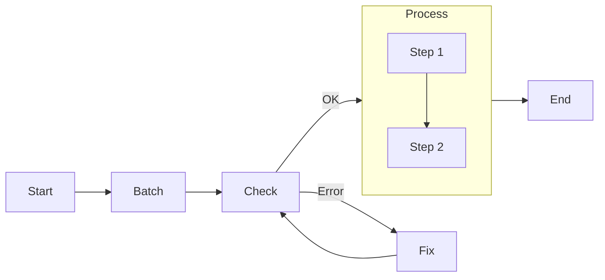
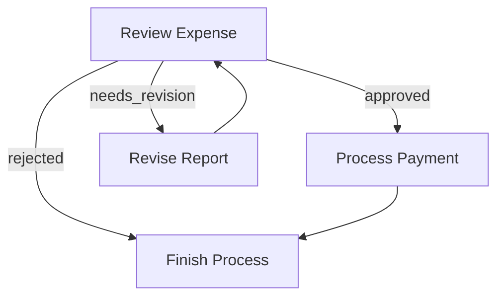
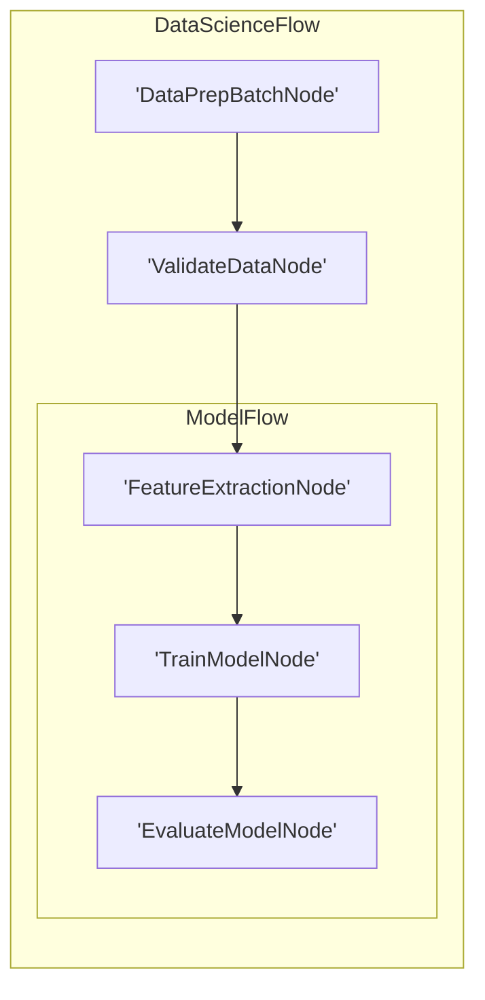

# Pocketflow - Core Abstraction

**Pages:** 21

---

## (Advanced) Async

**URL:** https://the-pocket.github.io/PocketFlow/core_abstraction/async.html

**Contents:**
- (Advanced) Async
  - Example

Async Nodes implement prep_async(), exec_async(), exec_fallback_async(), and/or post_async(). This is useful for:

Note: AsyncNode must be wrapped in AsyncFlow. AsyncFlow can also include regular (sync) nodes.

**Examples:**

Example 1 (python):
```python
class SummarizeThenVerify(AsyncNode):
    async def prep_async(self, shared):
        # Example: read a file asynchronously
        doc_text = await read_file_async(shared["doc_path"])
        return doc_text

    async def exec_async(self, prep_res):
        # Example: async LLM call
        summary = await call_llm_async(f"Summarize: {prep_res}")
        return summary

    async def post_async(self, shared, prep_res, exec_res):
        # Example: wait for user feedback
        decision = await gather_user_feedback(exec_res)
        if decision == "approve":
            shared["summary"] = e
...
```

---

## (Advanced) Multi-Agents

**URL:** https://the-pocket.github.io/PocketFlow/design_pattern/multi_agent.html

**Contents:**
- (Advanced) Multi-Agents
  - Example Agent Communication: Message Queue
  - Interactive Multi-Agent Example: Taboo Game

Multiple Agents can work together by handling subtasks and communicating the progress. Communication between agents is typically implemented using message queues in shared storage.

Most of time, you don’t need Multi-Agents. Start with a simple solution first.

Here’s a simple example showing how to implement agent communication using asyncio.Queue. The agent listens for messages, processes them, and continues listening:

Here’s a more complex example where two agents play the word-guessing game Taboo. One agent provides hints while avoiding forbidden words, and another agent tries to guess the target word:

**Examples:**

Example 1 (python):
```python
class AgentNode(AsyncNode):
    async def prep_async(self, _):
        message_queue = self.params["messages"]
        message = await message_queue.get()
        print(f"Agent received: {message}")
        return message

# Create node and flow
agent = AgentNode()
agent >> agent  # connect to self
flow = AsyncFlow(start=agent)

# Create heartbeat sender
async def send_system_messages(message_queue):
    counter = 0
    messages = [
        "System status: all systems operational",
        "Memory usage: normal",
        "Network connectivity: stable",
        "Processing load: optimal"
    ]

...
```

Example 2 (unknown):
```unknown
Agent received: System status: all systems operational | timestamp_0
Agent received: Memory usage: normal | timestamp_1
Agent received: Network connectivity: stable | timestamp_2
Agent received: Processing load: optimal | timestamp_3
```

Example 3 (python):
```python
class AsyncHinter(AsyncNode):
    async def prep_async(self, shared):
        guess = await shared["hinter_queue"].get()
        if guess == "GAME_OVER":
            return None
        return shared["target_word"], shared["forbidden_words"], shared.get("past_guesses", [])

    async def exec_async(self, inputs):
        if inputs is None:
            return None
        target, forbidden, past_guesses = inputs
        prompt = f"Generate hint for '{target}'\nForbidden words: {forbidden}"
        if past_guesses:
            prompt += f"\nPrevious wrong guesses: {past_guesses}\nMake hint more 
...
```

Example 4 (unknown):
```unknown
Game starting!
Target word: nostalgia
Forbidden words: ['memory', 'past', 'remember', 'feeling', 'longing']

Hinter: Here's your hint - Thinking of childhood summer days
Guesser: I guess it's - popsicle

Hinter: Here's your hint - When childhood cartoons make you emotional
Guesser: I guess it's - nostalgic

Hinter: Here's your hint - When old songs move you
Guesser: I guess it's - memories

Hinter: Here's your hint - That warm emotion about childhood
Guesser: I guess it's - nostalgia
Game Over - Correct guess!
```

---

## (Advanced) Parallel

**URL:** https://the-pocket.github.io/PocketFlow/core_abstraction/parallel.html

**Contents:**
- (Advanced) Parallel
- AsyncParallelBatchNode
- AsyncParallelBatchFlow

Parallel Nodes and Flows let you run multiple Async Nodes and Flows concurrently—for example, summarizing multiple texts at once. This can improve performance by overlapping I/O and compute.

Because of Python’s GIL, parallel nodes and flows can’t truly parallelize CPU-bound tasks (e.g., heavy numerical computations). However, they excel at overlapping I/O-bound work—like LLM calls, database queries, API requests, or file I/O.

Ensure Tasks Are Independent: If each item depends on the output of a previous item, do not parallelize.

Beware of Rate Limits: Parallel calls can quickly trigger rate limits on LLM services. You may need a throttling mechanism (e.g., semaphores or sleep intervals).

Consider Single-Node Batch APIs: Some LLMs offer a batch inference API where you can send multiple prompts in a single call. This is more complex to implement but can be more efficient than launching many parallel requests and mitigates rate limits.

Like AsyncBatchNode, but run exec_async() in parallel:

Parallel version of BatchFlow. Each iteration of the sub-flow runs concurrently using different parameters:

**Examples:**

Example 1 (python):
```python
class ParallelSummaries(AsyncParallelBatchNode):
    async def prep_async(self, shared):
        # e.g., multiple texts
        return shared["texts"]

    async def exec_async(self, text):
        prompt = f"Summarize: {text}"
        return await call_llm_async(prompt)

    async def post_async(self, shared, prep_res, exec_res_list):
        shared["summary"] = "\n\n".join(exec_res_list)
        return "default"

node = ParallelSummaries()
flow = AsyncFlow(start=node)
```

Example 2 (python):
```python
class SummarizeMultipleFiles(AsyncParallelBatchFlow):
    async def prep_async(self, shared):
        return [{"filename": f} for f in shared["files"]]

sub_flow = AsyncFlow(start=LoadAndSummarizeFile())
parallel_flow = SummarizeMultipleFiles(start=sub_flow)
await parallel_flow.run_async(shared)
```

---

## Agentic Coding: Humans Design, Agents code!

**URL:** https://the-pocket.github.io/PocketFlow/guide.html

**Contents:**
- Agentic Coding: Humans Design, Agents code!
- Agentic Coding Steps
- Example LLM Project File Structure

If you are an AI agent involved in building LLM Systems, read this guide VERY, VERY carefully! This is the most important chapter in the entire document. Throughout development, you should always (1) start with a small and simple solution, (2) design at a high level (docs/design.md) before implementation, and (3) frequently ask humans for feedback and clarification.

Agentic Coding should be a collaboration between Human System Design and Agent Implementation:

If Humans can’t specify the flow, AI Agents can’t automate it! Before building an LLM system, thoroughly understand the problem and potential solution by manually solving example inputs to develop intuition.

Sometimes, design Utilities before Flow: For example, for an LLM project to automate a legacy system, the bottleneck will likely be the available interface to that system. Start by designing the hardest utilities for interfacing, and then build the flow around them.

Avoid Exception Handling in Utilities: If a utility function is called from a Node’s exec() method, avoid using try...except blocks within the utility. Let the Node’s built-in retry mechanism handle failures.

You’ll likely iterate a lot! Expect to repeat Steps 3–6 hundreds of times.

def call_llm(prompt: str) -> str: client = genai.Client( api_key=os.getenv(“GEMINI_API_KEY”, “”), ) model = os.getenv(“GEMINI_MODEL”, “gemini-2.5-flash”) response = client.models.generate_content(model=model, contents=[prompt]) return response.text

if name == “main”: test_prompt = “Hello, how are you?”

**Examples:**

Example 1 (mermaid):


Example 2 (python):
```python
# utils/call_llm.py
from openai import OpenAI

def call_llm(prompt):    
    client = OpenAI(api_key="YOUR_API_KEY_HERE")
    r = client.chat.completions.create(
        model="gpt-4o",
        messages=[{"role": "user", "content": prompt}]
    )
    return r.choices[0].message.content
          
if __name__ == "__main__":
    prompt = "What is the meaning of life?"
    print(call_llm(prompt))
```

Example 3 (unknown):
```unknown
shared = {
    "user": {
        "id": "user123",
        "context": {                # Another nested dict
            "weather": {"temp": 72, "condition": "sunny"},
            "location": "San Francisco"
        }
    },
    "results": {}                   # Empty dict to store outputs
}
```

Example 4 (unknown):
```unknown
my_project/
├── main.py
├── nodes.py
├── flow.py
├── utils/
│   ├── __init__.py
│   ├── call_llm.py
│   └── search_web.py
├── requirements.txt
└── docs/
    └── design.md
```

---

## Agent

**URL:** https://the-pocket.github.io/PocketFlow/design_pattern/agent.html

**Contents:**
- Agent
- Implement Agent with Graph
- Example Good Action Design
- Example: Search Agent

Agent is a powerful design pattern in which nodes can take dynamic actions based on the context.

The core of building high-performance and reliable agents boils down to:

Context Management: Provide relevant, minimal context. For example, rather than including an entire chat history, retrieve the most relevant via RAG. Even with larger context windows, LLMs still fall victim to “lost in the middle”, overlooking mid-prompt content.

Action Space: Provide a well-structured and unambiguous set of actions—avoiding overlap like separate read_databases or read_csvs. Instead, import CSVs into the database.

Incremental: Feed content in manageable chunks (500 lines or 1 page) instead of all at once.

Overview-zoom-in: First provide high-level structure (table of contents, summary), then allow drilling into details (raw texts).

Parameterized/Programmable: Instead of fixed actions, enable parameterized (columns to select) or programmable (SQL queries) actions, for example, to read CSV files.

Backtracking: Let the agent undo the last step instead of restarting entirely, preserving progress when encountering errors or dead ends.

**Examples:**

Example 1 (unknown):
```unknown
f"""
### CONTEXT
Task: {task_description}
Previous Actions: {previous_actions}
Current State: {current_state}

### ACTION SPACE
[1] search
  Description: Use web search to get results
  Parameters:
    - query (str): What to search for

[2] answer
  Description: Conclude based on the results
  Parameters:
    - result (str): Final answer to provide

### NEXT ACTION
Decide the next action based on the current context and available action space.
Return your response in the following format:

```yaml
thinking: |
    <your step-by-step reasoning process>
action: <action_name>
parameters:
    <para
...
```

Example 2 (python):
```python
class DecideAction(Node):
    def prep(self, shared):
        context = shared.get("context", "No previous search")
        query = shared["query"]
        return query, context
        
    def exec(self, inputs):
        query, context = inputs
        prompt = f"""
Given input: {query}
Previous search results: {context}
Should I: 1) Search web for more info 2) Answer with current knowledge
Output in yaml:
```yaml
action: search/answer
reason: why this action
search_term: search phrase if action is search
```"""
        resp = call_llm(prompt)
        yaml_str = resp.split("```yaml")[1].spli
...
```

---

## Batch

**URL:** https://the-pocket.github.io/PocketFlow/core_abstraction/batch.html

**Contents:**
- Batch
- 1. BatchNode
  - Example: Summarize a Large File
- 2. BatchFlow
  - Key Differences from BatchNode
  - Example: Summarize Many Files
  - Under the Hood
- 3. Nested or Multi-Level Batches

Batch makes it easier to handle large inputs in one Node or rerun a Flow multiple times. Example use cases:

A BatchNode extends Node but changes prep() and exec():

A BatchFlow runs a Flow multiple times, each time with different params. Think of it as a loop that replays the Flow for each parameter set.

Important: Unlike BatchNode, which processes items and modifies the shared store:

You can nest a BatchFlow in another BatchFlow. For instance:

At each level, BatchFlow merges its own param dict with the parent’s. By the time you reach the innermost node, the final params is the merged result of all parents in the chain. This way, a nested structure can keep track of the entire context (e.g., directory + file name) at once.

**Examples:**

Example 1 (python):
```python
class MapSummaries(BatchNode):
    def prep(self, shared):
        # Suppose we have a big file; chunk it
        content = shared["data"]
        chunk_size = 10000
        chunks = [content[i:i+chunk_size] for i in range(0, len(content), chunk_size)]
        return chunks

    def exec(self, chunk):
        prompt = f"Summarize this chunk in 10 words: {chunk}"
        summary = call_llm(prompt)
        return summary

    def post(self, shared, prep_res, exec_res_list):
        combined = "\n".join(exec_res_list)
        shared["summary"] = combined
        return "default"

map_summaries = 
...
```

Example 2 (python):
```python
class SummarizeAllFiles(BatchFlow):
    def prep(self, shared):
        # IMPORTANT: Return a list of param dictionaries (not data for processing)
        filenames = list(shared["data"].keys())  # e.g., ["file1.txt", "file2.txt", ...]
        return [{"filename": fn} for fn in filenames]

# Child node that accesses filename from params, not shared store
class LoadFile(Node):
    def prep(self, shared):
        # Access filename from params (not from shared)
        filename = self.params["filename"]  # Important! Use self.params, not shared
        return filename
        
    def exec(self, 
...
```

Example 3 (python):
```python
class FileBatchFlow(BatchFlow):
    def prep(self, shared):
        # Access directory from params (set by parent)
        directory = self.params["directory"]
        # e.g., files = ["file1.txt", "file2.txt", ...]
        files = [f for f in os.listdir(directory) if f.endswith(".txt")]
        return [{"filename": f} for f in files]

class DirectoryBatchFlow(BatchFlow):
    def prep(self, shared):
        directories = [ "/path/to/dirA", "/path/to/dirB"]
        return [{"directory": d} for d in directories]

# The actual processing node
class ProcessFile(Node):
    def prep(self, shared):
 
...
```

---

## Communication

**URL:** https://the-pocket.github.io/PocketFlow/core_abstraction/communication.html

**Contents:**
- Communication
- 1. Shared Store
  - Overview
  - Example
- 2. Params
  - Example

Nodes and Flows communicate in 2 ways:

Shared Store (for almost all the cases)

You shall design the data structure and populate it ahead.

Separation of Concerns: Use Shared Store for almost all cases to separate Data Schema from Compute Logic! This approach is both flexible and easy to manage, resulting in more maintainable code. Params is more a syntax sugar for Batch.

Params (only for Batch)

If you know memory management, think of the Shared Store like a heap (shared by all function calls), and Params like a stack (assigned by the caller).

A shared store is typically an in-mem dictionary, like:

It can also contain local file handlers, DB connections, or a combination for persistence. We recommend deciding the data structure or DB schema first based on your app requirements.

Params let you store per-Node or per-Flow config that doesn’t need to live in the shared store. They are:

Only set the uppermost Flow params because others will be overwritten by the parent Flow.

If you need to set child node params, see Batch.

Typically, Params are identifiers (e.g., file name, page number). Use them to fetch the task you assigned or write to a specific part of the shared store.

**Examples:**

Example 1 (unknown):
```unknown
shared = {"data": {}, "summary": {}, "config": {...}, ...}
```

Example 2 (python):
```python
class LoadData(Node):
    def post(self, shared, prep_res, exec_res):
        # We write data to shared store
        shared["data"] = "Some text content"
        return None

class Summarize(Node):
    def prep(self, shared):
        # We read data from shared store
        return shared["data"]

    def exec(self, prep_res):
        # Call LLM to summarize
        prompt = f"Summarize: {prep_res}"
        summary = call_llm(prompt)
        return summary

    def post(self, shared, prep_res, exec_res):
        # We write summary to shared store
        shared["summary"] = exec_res
        re
...
```

Example 3 (python):
```python
# 1) Create a Node that uses params
class SummarizeFile(Node):
    def prep(self, shared):
        # Access the node's param
        filename = self.params["filename"]
        return shared["data"].get(filename, "")

    def exec(self, prep_res):
        prompt = f"Summarize: {prep_res}"
        return call_llm(prompt)

    def post(self, shared, prep_res, exec_res):
        filename = self.params["filename"]
        shared["summary"][filename] = exec_res
        return "default"

# 2) Set params
node = SummarizeFile()

# 3) Set Node params directly (for testing)
node.set_params({"filename": "
...
```

---

## Embedding

**URL:** https://the-pocket.github.io/PocketFlow/utility_function/embedding.html

**Contents:**
- Embedding
- Example Python Code
  - 1. OpenAI
  - 2. Azure OpenAI
  - 3. Google Vertex AI
  - 4. AWS Bedrock
  - 5. Cohere
  - 6. Hugging Face
  - 7. Jina

Below you will find an overview table of various text embedding APIs, along with example Python code.

Embedding is more a micro optimization, compared to the Flow Design.

It’s recommended to start with the most convenient one and optimize later.

**Examples:**

Example 1 (python):
```python
from openai import OpenAI

client = OpenAI(api_key="YOUR_API_KEY")
response = client.embeddings.create(
    model="text-embedding-ada-002",
    input=text
)
    
# Extract the embedding vector from the response
embedding = response.data[0].embedding
embedding = np.array(embedding, dtype=np.float32)
print(embedding)
```

Example 2 (unknown):
```unknown
import openai

openai.api_type = "azure"
openai.api_base = "https://YOUR_RESOURCE_NAME.openai.azure.com"
openai.api_version = "2023-03-15-preview"
openai.api_key = "YOUR_AZURE_API_KEY"

resp = openai.Embedding.create(engine="ada-embedding", input="Hello world")
vec = resp["data"][0]["embedding"]
print(vec)
```

Example 3 (python):
```python
from vertexai.preview.language_models import TextEmbeddingModel
import vertexai

vertexai.init(project="YOUR_GCP_PROJECT_ID", location="us-central1")
model = TextEmbeddingModel.from_pretrained("textembedding-gecko@001")

emb = model.get_embeddings(["Hello world"])
print(emb[0])
```

Example 4 (unknown):
```unknown
import boto3, json

client = boto3.client("bedrock-runtime", region_name="us-east-1")
body = {"inputText": "Hello world"}
resp = client.invoke_model(modelId="amazon.titan-embed-text-v2:0", contentType="application/json", body=json.dumps(body))
resp_body = json.loads(resp["body"].read())
vec = resp_body["embedding"]
print(vec)
```

---

## Flow

**URL:** https://the-pocket.github.io/PocketFlow/core_abstraction/flow.html

**Contents:**
- Flow
- 1. Action-based Transitions
- 2. Creating a Flow
  - Example: Simple Sequence
  - Example: Branching & Looping
  - Running Individual Nodes vs. Running a Flow
- 3. Nested Flows
  - Flow’s Node Methods
  - Basic Flow Nesting
  - Example: Order Processing Pipeline

A Flow orchestrates a graph of Nodes. You can chain Nodes in a sequence or create branching depending on the Actions returned from each Node’s post().

Each Node’s post() returns an Action string. By default, if post() doesn’t return anything, we treat that as "default".

You define transitions with the syntax:

Basic default transition: node_a >> node_b This means if node_a.post() returns "default", go to node_b. (Equivalent to node_a - "default" >> node_b)

Named action transition: node_a - "action_name" >> node_b This means if node_a.post() returns "action_name", go to node_b.

It’s possible to create loops, branching, or multi-step flows.

A Flow begins with a start node. You call Flow(start=some_node) to specify the entry point. When you call flow.run(shared), it executes the start node, looks at its returned Action from post(), follows the transition, and continues until there’s no next node.

Here’s a minimal flow of two nodes in a chain:

Here’s a simple expense approval flow that demonstrates branching and looping. The ReviewExpense node can return three possible Actions:

We can wire them like this:

Let’s see how it flows:

node.run(shared) does not proceed to the successor. This is mainly for debugging or testing a single node.

Always use flow.run(...) in production to ensure the full pipeline runs correctly.

A Flow can act like a Node, which enables powerful composition patterns. This means you can:

A Flow is also a Node, so it will run prep() and post(). However:

Here’s how to connect a flow to another node:

When parent_flow.run() executes:

Here’s a practical example that breaks down order processing into nested flows:

This creates a clean separation of concerns while maintaining a clear execution path:

**Examples:**

Example 1 (unknown):
```unknown
node_a >> node_b
flow = Flow(start=node_a)
flow.run(shared)
```

Example 2 (unknown):
```unknown
# Define the flow connections
review - "approved" >> payment        # If approved, process payment
review - "needs_revision" >> revise   # If needs changes, go to revision
review - "rejected" >> finish         # If rejected, finish the process

revise >> review   # After revision, go back for another review
payment >> finish  # After payment, finish the process

flow = Flow(start=review)
```

Example 3 (mermaid):


Example 4 (unknown):
```unknown
# Create a sub-flow
node_a >> node_b
subflow = Flow(start=node_a)

# Connect it to another node
subflow >> node_c

# Create the parent flow
parent_flow = Flow(start=subflow)
```

---

## LLM Wrappers

**URL:** https://the-pocket.github.io/PocketFlow/utility_function/llm.html

**Contents:**
- LLM Wrappers
- Improvements

Check out libraries like litellm. Here, we provide some minimal example implementations:

Store the API key in an environment variable like OPENAI_API_KEY for security.

Feel free to enhance your call_llm function as needed. Here are examples:

⚠️ Caching conflicts with Node retries, as retries yield the same result.

To address this, you could use cached results only if not retried.

**Examples:**

Example 1 (python):
```python
def call_llm(prompt):
     from openai import OpenAI
     client = OpenAI(api_key="YOUR_API_KEY_HERE")
     r = client.chat.completions.create(
         model="gpt-4o",
         messages=[{"role": "user", "content": prompt}]
     )
     return r.choices[0].message.content

 # Example usage
 call_llm("How are you?")
```

Example 2 (python):
```python
def call_llm(prompt):
     from anthropic import Anthropic
     client = Anthropic(api_key="YOUR_API_KEY_HERE")
     r = client.messages.create(
         model="claude-sonnet-4-0",
         messages=[
             {"role": "user", "content": prompt}
         ]
     )
     return r.content[0].text
```

Example 3 (python):
```python
def call_llm(prompt):
 from google import genai
 client = genai.Client(api_key='GEMINI_API_KEY')
     response = client.models.generate_content(
     model='gemini-2.5-pro',
     contents=prompt
 )
 return response.text
```

Example 4 (python):
```python
def call_llm(prompt):
     from openai import AzureOpenAI
     client = AzureOpenAI(
         azure_endpoint="https://<YOUR_RESOURCE_NAME>.openai.azure.com/",
         api_key="YOUR_API_KEY_HERE",
         api_version="2023-05-15"
     )
     r = client.chat.completions.create(
         model="<YOUR_DEPLOYMENT_NAME>",
         messages=[{"role": "user", "content": prompt}]
     )
     return r.choices[0].message.content
```

---

## Map Reduce

**URL:** https://the-pocket.github.io/PocketFlow/design_pattern/mapreduce.html

**Contents:**
- Map Reduce
  - Example: Document Summarization

MapReduce is a design pattern suitable when you have either:

and there is a logical way to break the task into smaller, ideally independent parts.

You first break down the task using BatchNode in the map phase, followed by aggregation in the reduce phase.

Performance Tip: The example above works sequentially. You can speed up the map phase by running it in parallel. See (Advanced) Parallel for more details.

**Examples:**

Example 1 (python):
```python
class SummarizeAllFiles(BatchNode):
    def prep(self, shared):
        files_dict = shared["files"]  # e.g. 10 files
        return list(files_dict.items())  # [("file1.txt", "aaa..."), ("file2.txt", "bbb..."), ...]

    def exec(self, one_file):
        filename, file_content = one_file
        summary_text = call_llm(f"Summarize the following file:\n{file_content}")
        return (filename, summary_text)

    def post(self, shared, prep_res, exec_res_list):
        shared["file_summaries"] = dict(exec_res_list)

class CombineSummaries(Node):
    def prep(self, shared):
        return share
...
```

---

## Node

**URL:** https://the-pocket.github.io/PocketFlow/core_abstraction/node.html

**Contents:**
- Node
  - Fault Tolerance & Retries
  - Graceful Fallback
  - Example: Summarize file

A Node is the smallest building block. Each Node has 3 steps prep->exec->post:

Why 3 steps? To enforce the principle of separation of concerns. The data storage and data processing are operated separately.

All steps are optional. E.g., you can only implement prep and post if you just need to process data.

You can retry exec() if it raises an exception via two parameters when define the Node:

When an exception occurs in exec(), the Node automatically retries until:

You can get the current retry times (0-based) from self.cur_retry.

To gracefully handle the exception (after all retries) rather than raising it, override:

By default, it just re-raises exception. But you can return a fallback result instead, which becomes the exec_res passed to post().

**Examples:**

Example 1 (unknown):
```unknown
my_node = SummarizeFile(max_retries=3, wait=10)
```

Example 2 (python):
```python
class RetryNode(Node):
    def exec(self, prep_res):
        print(f"Retry {self.cur_retry} times")
        raise Exception("Failed")
```

Example 3 (python):
```python
def exec_fallback(self, prep_res, exc):
    raise exc
```

Example 4 (python):
```python
class SummarizeFile(Node):
    def prep(self, shared):
        return shared["data"]

    def exec(self, prep_res):
        if not prep_res:
            return "Empty file content"
        prompt = f"Summarize this text in 10 words: {prep_res}"
        summary = call_llm(prompt)  # might fail
        return summary

    def exec_fallback(self, prep_res, exc):
        # Provide a simple fallback instead of crashing
        return "There was an error processing your request."

    def post(self, shared, prep_res, exec_res):
        shared["summary"] = exec_res
        # Return "default" by not r
...
```

---

## Pocket Flow

**URL:** https://the-pocket.github.io/PocketFlow/

**Contents:**
- Pocket Flow
- Core Abstraction
- Design Pattern
- Utility Function
- Ready to build your Apps?

A 100-line minimalist LLM framework for Agents, Task Decomposition, RAG, etc.

We model the LLM workflow as a Graph + Shared Store:

From there, it’s easy to implement popular design patterns:

We do not provide built-in utilities. Instead, we offer examples—please implement your own:

Why not built-in?: I believe it’s a bad practice for vendor-specific APIs in a general framework:

Check out Agentic Coding Guidance, the fastest way to develop LLM projects with Pocket Flow!

---

## RAG (Retrieval Augmented Generation)

**URL:** https://the-pocket.github.io/PocketFlow/design_pattern/rag.html

**Contents:**
- RAG (Retrieval Augmented Generation)
- Stage 1: Offline Indexing
- Stage 2: Online Query & Answer

For certain LLM tasks like answering questions, providing relevant context is essential. One common architecture is a two-stage RAG pipeline:

We create three Nodes:

**Examples:**

Example 1 (python):
```python
class ChunkDocs(BatchNode):
    def prep(self, shared):
        # A list of file paths in shared["files"]. We process each file.
        return shared["files"]

    def exec(self, filepath):
        # read file content. In real usage, do error handling.
        with open(filepath, "r", encoding="utf-8") as f:
            text = f.read()
        # chunk by 100 chars each
        chunks = []
        size = 100
        for i in range(0, len(text), size):
            chunks.append(text[i : i + size])
        return chunks
    
    def post(self, shared, prep_res, exec_res_list):
        # exec_res
...
```

Example 2 (unknown):
```unknown
shared = {
    "files": ["doc1.txt", "doc2.txt"],  # any text files
}
OfflineFlow.run(shared)
```

Example 3 (python):
```python
class EmbedQuery(Node):
    def prep(self, shared):
        return shared["question"]

    def exec(self, question):
        return get_embedding(question)

    def post(self, shared, prep_res, q_emb):
        shared["q_emb"] = q_emb

class RetrieveDocs(Node):
    def prep(self, shared):
        # We'll need the query embedding, plus the offline index/chunks
        return shared["q_emb"], shared["index"], shared["all_chunks"]

    def exec(self, inputs):
        q_emb, index, chunks = inputs
        I, D = search_index(index, q_emb, top_k=1)
        best_id = I[0][0]
        relevant_chunk = 
...
```

Example 4 (unknown):
```unknown
# Suppose we already ran OfflineFlow and have:
# shared["all_chunks"], shared["index"], etc.
shared["question"] = "Why do people like cats?"

OnlineFlow.run(shared)
# final answer in shared["answer"]
```

---

## Structured Output

**URL:** https://the-pocket.github.io/PocketFlow/design_pattern/structure.html

**Contents:**
- Structured Output
  - Example Use Cases
- Prompt Engineering
  - Example Text Summarization
  - Why YAML instead of JSON?

In many use cases, you may want the LLM to output a specific structure, such as a list or a dictionary with predefined keys.

There are several approaches to achieve a structured output:

In practice, Prompting is simple and reliable for modern LLMs.

When prompting the LLM to produce structured output:

Besides using assert statements, another popular way to validate schemas is Pydantic

Current LLMs struggle with escaping. YAML is easier with strings since they don’t always need quotes.

**Examples:**

Example 1 (unknown):
```unknown
product:
  name: Widget Pro
  price: 199.99
  description: |
    A high-quality widget designed for professionals.
    Recommended for advanced users.
```

Example 2 (unknown):
```unknown
summary:
  - This product is easy to use.
  - It is cost-effective.
  - Suitable for all skill levels.
```

Example 3 (unknown):
```unknown
server:
  host: 127.0.0.1
  port: 8080
  ssl: true
```

Example 4 (javascript):
```javascript
class SummarizeNode(Node):
    def exec(self, prep_res):
        # Suppose `prep_res` is the text to summarize.
        prompt = f"""
Please summarize the following text as YAML, with exactly 3 bullet points

{prep_res}

Now, output:
```yaml
summary:
  - bullet 1
  - bullet 2
  - bullet 3
```"""
        response = call_llm(prompt)
        yaml_str = response.split("```yaml")[1].split("```")[0].strip()

        import yaml
        structured_result = yaml.safe_load(yaml_str)

        assert "summary" in structured_result
        assert isinstance(structured_result["summary"], list)

        ret
...
```

---

## Text Chunking

**URL:** https://the-pocket.github.io/PocketFlow/utility_function/chunking.html

**Contents:**
- Text Chunking
- Example Python Code Samples
  - 1. Naive (Fixed-Size) Chunking
  - 2. Sentence-Based Chunking
  - 3. Other Chunking

We recommend some implementations of commonly used text chunking approaches.

Text Chunking is more a micro optimization, compared to the Flow Design.

It’s recommended to start with the Naive Chunking and optimize later.

Splits text by a fixed number of words, ignoring sentence or semantic boundaries.

However, sentences are often cut awkwardly, losing coherence.

However, might not handle very long sentences or paragraphs well.

**Examples:**

Example 1 (python):
```python
def fixed_size_chunk(text, chunk_size=100):
    chunks = []
    for i in range(0, len(text), chunk_size):
        chunks.append(text[i : i + chunk_size])
    return chunks
```

Example 2 (python):
```python
import nltk

def sentence_based_chunk(text, max_sentences=2):
    sentences = nltk.sent_tokenize(text)
    chunks = []
    for i in range(0, len(sentences), max_sentences):
        chunks.append(" ".join(sentences[i : i + max_sentences]))
    return chunks
```

---

## Text-to-Speech

**URL:** https://the-pocket.github.io/PocketFlow/utility_function/text_to_speech.html

**Contents:**
- Text-to-Speech
- Example Python Code
  - Amazon Polly
  - Google Cloud TTS
  - Azure TTS
  - IBM Watson TTS
  - ElevenLabs

**Examples:**

Example 1 (python):
```python
import boto3

polly = boto3.client("polly", region_name="us-east-1",
                     aws_access_key_id="YOUR_AWS_ACCESS_KEY_ID",
                     aws_secret_access_key="YOUR_AWS_SECRET_ACCESS_KEY")

resp = polly.synthesize_speech(
    Text="Hello from Polly!",
    OutputFormat="mp3",
    VoiceId="Joanna"
)

with open("polly.mp3", "wb") as f:
    f.write(resp["AudioStream"].read())
```

Example 2 (python):
```python
from google.cloud import texttospeech

client = texttospeech.TextToSpeechClient()
input_text = texttospeech.SynthesisInput(text="Hello from Google Cloud TTS!")
voice = texttospeech.VoiceSelectionParams(language_code="en-US")
audio_cfg = texttospeech.AudioConfig(audio_encoding=texttospeech.AudioEncoding.MP3)

resp = client.synthesize_speech(input=input_text, voice=voice, audio_config=audio_cfg)

with open("gcloud_tts.mp3", "wb") as f:
    f.write(resp.audio_content)
```

Example 3 (python):
```python
import azure.cognitiveservices.speech as speechsdk

speech_config = speechsdk.SpeechConfig(
    subscription="AZURE_KEY", region="AZURE_REGION")
audio_cfg = speechsdk.audio.AudioConfig(filename="azure_tts.wav")

synthesizer = speechsdk.SpeechSynthesizer(
    speech_config=speech_config,
    audio_config=audio_cfg
)

synthesizer.speak_text_async("Hello from Azure TTS!").get()
```

Example 4 (python):
```python
from ibm_watson import TextToSpeechV1
from ibm_cloud_sdk_core.authenticators import IAMAuthenticator

auth = IAMAuthenticator("IBM_API_KEY")
service = TextToSpeechV1(authenticator=auth)
service.set_service_url("IBM_SERVICE_URL")

resp = service.synthesize(
    "Hello from IBM Watson!",
    voice="en-US_AllisonV3Voice",
    accept="audio/mp3"
).get_result()

with open("ibm_tts.mp3", "wb") as f:
    f.write(resp.content)
```

---

## Vector Databases

**URL:** https://the-pocket.github.io/PocketFlow/utility_function/vector.html

**Contents:**
- Vector Databases
- Example Python Code
  - FAISS
  - Pinecone
  - Qdrant
  - Weaviate
  - Milvus
  - Chroma
  - Redis

Below is a table of the popular vector search solutions:

Below are basic usage snippets for each tool.

**Examples:**

Example 1 (unknown):
```unknown
import faiss
import numpy as np

# Dimensionality of embeddings
d = 128

# Create a flat L2 index
index = faiss.IndexFlatL2(d)

# Random vectors
data = np.random.random((1000, d)).astype('float32')
index.add(data)

# Query
query = np.random.random((1, d)).astype('float32')
D, I = index.search(query, k=5)

print("Distances:", D)
print("Neighbors:", I)
```

Example 2 (unknown):
```unknown
import pinecone

pinecone.init(api_key="YOUR_API_KEY", environment="YOUR_ENV")

index_name = "my-index"

# Create the index if it doesn't exist
if index_name not in pinecone.list_indexes():
    pinecone.create_index(name=index_name, dimension=128)

# Connect
index = pinecone.Index(index_name)

# Upsert
vectors = [
    ("id1", [0.1]*128),
    ("id2", [0.2]*128)
]
index.upsert(vectors)

# Query
response = index.query([[0.15]*128], top_k=3)
print(response)
```

Example 3 (python):
```python
import qdrant_client
from qdrant_client.models import Distance, VectorParams, PointStruct

client = qdrant_client.QdrantClient(
    url="https://YOUR-QDRANT-CLOUD-ENDPOINT",
    api_key="YOUR_API_KEY"
)

collection = "my_collection"
client.recreate_collection(
    collection_name=collection,
    vectors_config=VectorParams(size=128, distance=Distance.COSINE)
)

points = [
    PointStruct(id=1, vector=[0.1]*128, payload={"type": "doc1"}),
    PointStruct(id=2, vector=[0.2]*128, payload={"type": "doc2"}),
]

client.upsert(collection_name=collection, points=points)

results = client.search(
    c
...
```

Example 4 (unknown):
```unknown
import weaviate

client = weaviate.Client("https://YOUR-WEAVIATE-CLOUD-ENDPOINT")

schema = {
    "classes": [
        {
            "class": "Article",
            "vectorizer": "none"
        }
    ]
}
client.schema.create(schema)

obj = {
    "title": "Hello World",
    "content": "Weaviate vector search"
}
client.data_object.create(obj, "Article", vector=[0.1]*128)

resp = (
    client.query
    .get("Article", ["title", "content"])
    .with_near_vector({"vector": [0.15]*128})
    .with_limit(3)
    .do()
)
print(resp)
```

---

## Visualization and Debugging

**URL:** https://the-pocket.github.io/PocketFlow/utility_function/viz.html

**Contents:**
- Visualization and Debugging
- 1. Visualization with Mermaid
- 2. Call Stack Debugging

Similar to LLM wrappers, we don’t provide built-in visualization and debugging. Here, we recommend some minimal (and incomplete) implementations These examples can serve as a starting point for your own tooling.

This code recursively traverses the nested graph, assigns unique IDs to each node, and treats Flow nodes as subgraphs to generate Mermaid syntax for a hierarchical visualization.

For example, suppose we have a complex Flow for data science:

The code generates a Mermaid diagram:

For visualization based on d3.js, check out the cookbook.

It would be useful to print the Node call stacks for debugging. This can be achieved by inspecting the runtime call stack:

For example, suppose we have a complex Flow for data science:

The output would be: Call stack: ['EvaluateModelNode', 'ModelFlow', 'DataScienceFlow']

For a more complete implementation, check out the cookbook.

**Examples:**

Example 1 (python):
```python
def build_mermaid(start):
    ids, visited, lines = {}, set(), ["graph LR"]
    ctr = 1
    def get_id(n):
        nonlocal ctr
        return ids[n] if n in ids else (ids.setdefault(n, f"N{ctr}"), (ctr := ctr + 1))[0]
    def link(a, b):
        lines.append(f"    {a} --> {b}")
    def walk(node, parent=None):
        if node in visited:
            return parent and link(parent, get_id(node))
        visited.add(node)
        if isinstance(node, Flow):
            node.start_node and parent and link(parent, get_id(node.start_node))
            lines.append(f"\n    subgraph sub_flow_{get_id(n
...
```

Example 2 (python):
```python
class DataPrepBatchNode(BatchNode):
    def prep(self,shared): return []
class ValidateDataNode(Node): pass
class FeatureExtractionNode(Node): pass
class TrainModelNode(Node): pass
class EvaluateModelNode(Node): pass
class ModelFlow(Flow): pass
class DataScienceFlow(Flow):pass

feature_node = FeatureExtractionNode()
train_node = TrainModelNode()
evaluate_node = EvaluateModelNode()
feature_node >> train_node >> evaluate_node
model_flow = ModelFlow(start=feature_node)
data_prep_node = DataPrepBatchNode()
validate_node = ValidateDataNode()
data_prep_node >> validate_node >> model_flow
data_scienc
...
```

Example 3 (mermaid):


Example 4 (python):
```python
import inspect

def get_node_call_stack():
    stack = inspect.stack()
    node_names = []
    seen_ids = set()
    for frame_info in stack[1:]:
        local_vars = frame_info.frame.f_locals
        if 'self' in local_vars:
            caller_self = local_vars['self']
            if isinstance(caller_self, BaseNode) and id(caller_self) not in seen_ids:
                seen_ids.add(id(caller_self))
                node_names.append(type(caller_self).__name__)
    return node_names
```

---

## Web Search

**URL:** https://the-pocket.github.io/PocketFlow/utility_function/websearch.html

**Contents:**
- Web Search
- Example Python Code
  - 1. Google Custom Search JSON API
  - 2. Bing Web Search API
  - 3. DuckDuckGo Instant Answer
  - 4. Brave Search API
  - 5. SerpApi

We recommend some implementations of commonly used web search tools.

**Examples:**

Example 1 (unknown):
```unknown
import requests

API_KEY = "YOUR_API_KEY"
CX_ID = "YOUR_CX_ID"
query = "example"

url = "https://www.googleapis.com/customsearch/v1"
params = {
    "key": API_KEY,
    "cx": CX_ID,
    "q": query
}

response = requests.get(url, params=params)
results = response.json()
print(results)
```

Example 2 (unknown):
```unknown
import requests

SUBSCRIPTION_KEY = "YOUR_BING_API_KEY"
query = "example"

url = "https://api.bing.microsoft.com/v7.0/search"
headers = {"Ocp-Apim-Subscription-Key": SUBSCRIPTION_KEY}
params = {"q": query}

response = requests.get(url, headers=headers, params=params)
results = response.json()
print(results)
```

Example 3 (unknown):
```unknown
import requests

query = "example"
url = "https://api.duckduckgo.com/"
params = {
    "q": query,
    "format": "json"
}

response = requests.get(url, params=params)
results = response.json()
print(results)
```

Example 4 (unknown):
```unknown
import requests

SUBSCRIPTION_TOKEN = "YOUR_BRAVE_API_TOKEN"
query = "example"

url = "https://api.search.brave.com/res/v1/web/search"
headers = {
    "X-Subscription-Token": SUBSCRIPTION_TOKEN
}
params = {
    "q": query
}

response = requests.get(url, headers=headers, params=params)
results = response.json()
print(results)
```

---

## Workflow

**URL:** https://the-pocket.github.io/PocketFlow/design_pattern/workflow.html

**Contents:**
- Workflow
  - Example: Article Writing

Many real-world tasks are too complex for one LLM call. The solution is to Task Decomposition: decompose them into a chain of multiple Nodes.

You usually need multiple iterations to find the sweet spot. If the task has too many edge cases, consider using Agents.

For dynamic cases, consider using Agents.

**Examples:**

Example 1 (python):
```python
class GenerateOutline(Node):
    def prep(self, shared): return shared["topic"]
    def exec(self, topic): return call_llm(f"Create a detailed outline for an article about {topic}")
    def post(self, shared, prep_res, exec_res): shared["outline"] = exec_res

class WriteSection(Node):
    def prep(self, shared): return shared["outline"]
    def exec(self, outline): return call_llm(f"Write content based on this outline: {outline}")
    def post(self, shared, prep_res, exec_res): shared["draft"] = exec_res

class ReviewAndRefine(Node):
    def prep(self, shared): return shared["draft"]
    def e
...
```

---
